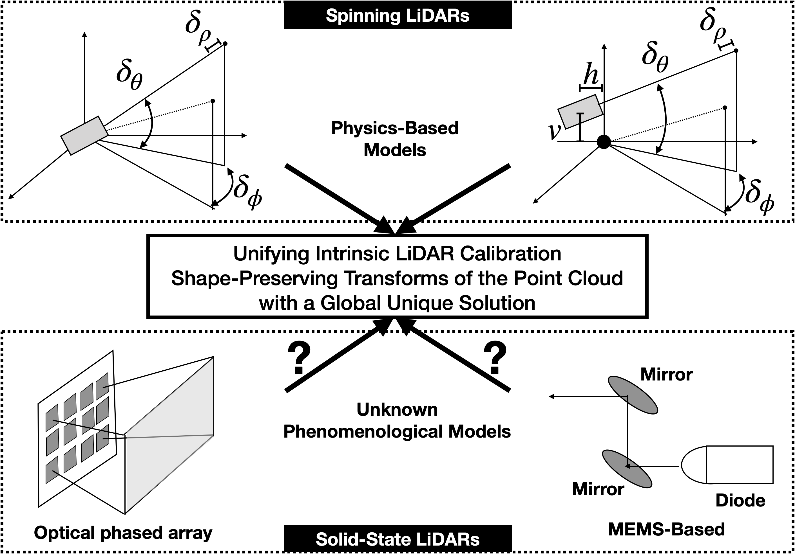

# Global Intrinsic 3D LiDAR Calibration
## Overview
This is a package for globally solving intrinsic calibration of a 3D LiDAR described in paper: Global Unifying Intrinsic Calibration for Spinning and Solid-State LiDARs. In experimental data, we show that it outperforms physics-based models for a spinning LiDAR. In [simulation](https://github.com/UMich-BipedLab/lidar_simulator), we show how this perspective can be applied to a solid state LiDAR.  


* Authors: Bruce JK Huang, Chenxi Feng, Madhav Achar, Maani Ghaffari, and Jessy W. Grizzle
* Maintainer: [Bruce JK Huang](https://www.brucerobot.com/), brucejkh[at]gmail.com
* Affiliation: [The Biped Lab](https://www.biped.solutions/), the University of Michigan


This package has been tested under MATLAB 2019a and Ubuntu 18.04.
More detailed introduction will be updated in a week. Sorry for the inconvenience!


**[Issues]**
If you encounter _any_ issues, I would be happy to help. If you cannot find a related one in the existing issues, please open a new one. I will try my best to help! 

## Abstract
Sensor calibration, which can be intrinsic or extrinsic, is an essential step to achieve the measurement accuracy required for modern perception and navigation systems deployed on autonomous robots. Intrinsic calibration models for spinning LiDARs have been based on hypothesized physical mechanisms, resulting in anywhere from three to ten parameters to be estimated from data, while no phenomenological models have yet been proposed for solid-state LiDARs. Instead of going down that road, we propose to abstract away from the physics of a LiDAR type (spinning vs. solid-state, for example) and focus on the point cloud's spatial geometry generated by the sensor. By modeling the calibration parameters as an element of a matrix Lie Group, we achieve a unifying view of calibration for different types of LiDARs. We further prove mathematically that the proposed model is well-constrained (has a unique answer) given four appropriately orientated targets. The proof provides a guideline for target positioning in the form of a tetrahedron. Moreover, an existing semi-definite programming global solver for SE(3) can be modified to efficiently compute the optimal calibration parameters. For solid-state LiDARs, we illustrate how the method works in simulation. For spinning LiDARs, we show with experimental data that the proposed matrix Lie Group model performs equally well as physics-based models in terms of reducing the point-to-plane distance while being more robust to noise.


## Introduction Video
Please checkout the introduction [video](https://www.brucerobot.com/automatic-calibration). It highlights some importants keypoints in the paper!  

[](https://www.brucerobot.com/automatic-calibration)


## System Diagram Overview
This figure motivates the main contribution of the paper, a means of calibrating a LiDAR without modeling the physical mechanism itself. Top left: shows a simple physics-based calibration model for a spinning LiDAR. 
1. Top right: shows a similar model with more parameters, also for a spinning LiDAR. In the literature, the number of parameters can vary from three to 10.
2. Bottom left and bottom right show, respectively, an optical phased array solid-state LiDAR and a MEMS-based LiDAR. There are many design options and many manufacturing steps to fabricate these LiDAR. Is it necessary, or even possible, to parameterize all of them? This paper moves the attention to the geometry of the LiDAR's point cloud  and proposes that calibration can be achieved via shape-preserving transformations. 
3. In experiments, the proposed method outperforms the methods showed in top figures for spinning LiDAR, and via simulation, we support that it may be used to calibrate a solid-state LiDAR as well.




## Results Quick View
Varying levels of systematic error is introduced for a spinning LiDAR to test the robustness of the proposed alternating method on experimental data. 


On the left shows a factory-calibrated 32-Beam Velodyne ULTRA Puck measuring on a planer target. The measurements are not consistent and lead to a thickness of 6.2 cm point cloud with 1.4 cm P2P distance. On the right shows the calibration results of the proposed method. The thickness and P2P distance after calibration are 4.4 cm and 0.47 cm. 


## Why important? 
1. Intrinsic calibration ensures that obtained measurements are meaningful and valid!
2. The proposed model is mathematically proved to be well-constrained (i.e., a unique answer exists).
3. An efficient global optimizer is provided to determine the element of the Lie Group. 
4. Target placement is a tetrahedron (guided by the proof):
[](https://www.brucerobot.com/automatic-calibration)


## Calibration Targets
Any **square** targets would be fine. The dimensions are assumed known.
note: You can place any number of targets with different size in different datasets.

## Installation
1. Clone https://github.com/UMich-BipedLab/3D_lidar_intrinsic_calibration
2. Clone https://github.com/UMich-BipedLab/matlab_utils
3. Clone https://github.com/UMich-BipedLab/convex_relaxation_sim3 and follow the README.md there
to install CVX library

###### Note: 
To automatic extract LiDAR targets, we use [LiDARTag](https://github.com/UMich-BipedLab/LiDARTag) package and its [message](https://github.com/UMich-BipedLab/LiDARTag_msgs).

## Dataset
Please download datasets from here:
[Training dataset](https://drive.google.com/drive/folders/1JvsyqJjo6QBHG8SVGNighjNywdgKy67R)
[validation dataset](https://drive.google.com/drive/folders/1Jbgf1LbYXceT_C1EmoeJ4pJhc9fsctGu)

## Running
To get it run properly,
1. change the varible to corresponding path.
2. add the matlab_utils library to reposiotry.
3. run "setup.m" under the convex_relaxation_sim3 repo.

## Generate paper's results
* To generate Fig 5, run lidar_simulator/test_CNs_vs_tetrahedron_analysis.m
* To generate Fig 6, run LiDAR_intrinsic_calibration/main.m
* To generate Table 1, run LiDAR_intrinsic_calibration/generateTable1.m


## Citations
The detail is described in: 
Jiunn-Kai Huang, Chenxi Feng, Madhav Achar, Maani Ghaffari, and Jessy W. Grizzle, "Global Unifying Intrinsic Calibration for Spinning and Solid-State LiDARs" ([arXiv](https://arxiv.org/abs/2012.03321))

```
@article{huang2020global,
  title={Global Unifying Intrinsic Calibration for Spinning and Solid-State LiDARs},
  author={Huang, Jiunn-Kai and Feng, Chenxi and Achar, Madhav and Ghaffari, Maani and Grizzle, Jessy W},
  journal={arXiv preprint arXiv:2012.03321},
  year={2020}
}
```

